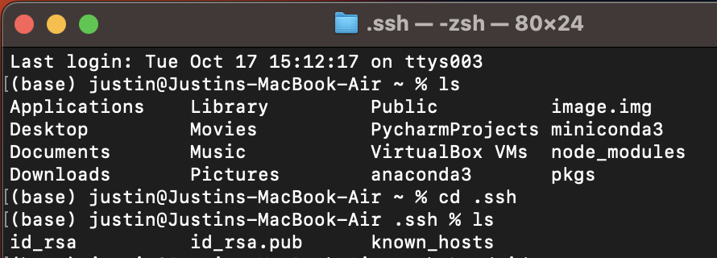
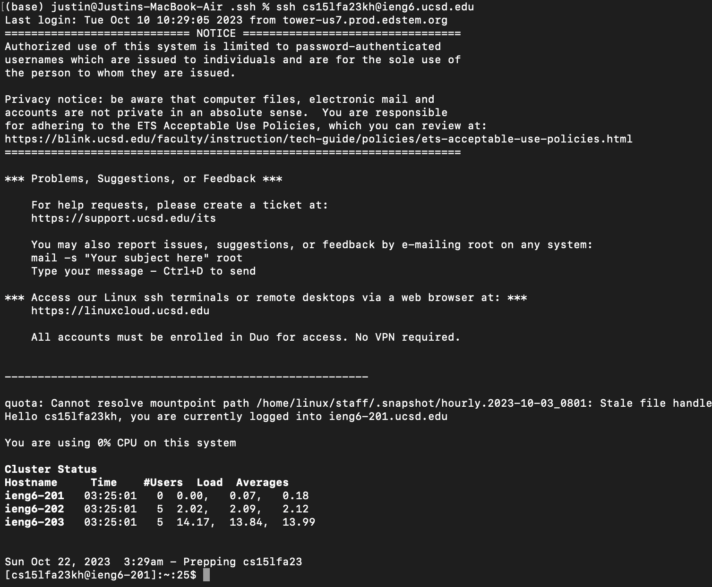

# Part 1 #
---

## Code: ##
<br />

```
import java.io.IOException;
import java.net.URI;
import java.util.ArrayList;

class Handler implements URLHandler {

    ArrayList<String> Strings = new ArrayList<String>();

    public String handleRequest(URI url) {
        if (url.getPath().equals("/")) {
            String output = "";
            for (int i = 0; i < Strings.size(); i++){
                output += String.format("%d. %s\n", i+1, Strings.get(i));
            }
            return output;
        } else {
            if (url.getPath().contains("/add-message")) {
                String[] parameters = url.getQuery().split("=");
                if (parameters[0].equals("s")) {
                    Strings.add(java.net.URLDecoder.decode(parameters[1], java.nio.charset.StandardCharsets.UTF_8));
                    return String.format("Message added!");
                }
            }
            return "404 Not Found!";
        }
    }
}

class StringServer {
    public static void main(String[] args) throws IOException {

        if(args.length == 0){
            System.out.println("Missing port number! Try any number between 1024 to 49151");
            return;
        }

        int port = Integer.parseInt(args[0]);

        Server.start(port, new Handler());
    }
}
```
---
## Screenshots: ##

### Message 1 ###
<br />

**Adding Message 1 to the ArrayList using** <br />
<br />

`/add-message?s=This is the first message`


<br />


<br />

<br />

**Displaying Message 1 on the Home Page:** <br />
<br />


<br />

1. _The server starts with the StringServer class, where the main function runs on launch. From here, the main function calls the Handler class, which runs the handleRequest function._
2. _The relevant argument for StringServer, specifically its main function, is the port we assign when starting the server. In this case, the port I used was ` 4000 ` . In handleRequest, the relevant argument is the active URL. Specifically, we check if there is either a ` / ` at the end of the URL, which signals us to display the current string list or an argument such as ` /add-message?s=This is the first message ` , which calls for ` This is the first message ` to be added to the ArrayList._
3. _For the main function in StringServer, if we don't specify a valid port, or if we don't provide a port, the program will immediately exit with a message displaying ` Missing port number! Try any number between 1024 to 49151 `. For handleRequest, the values of any arguments are checked for one of three cases:
   - the URL ends with ` / `, in which case the website displays the current list of added messages
   - the URL ends with ` /add-message?s=<string> `, in which case ` <string> ` is appended to the end of the ArrayList Strings
   - no change to the URL, in which case the page stays as it is
   - or an invalid argument, in which case the website displays a ` 404 Not Found! ` message

### Message 2 ###

<br />

**Adding Message 2 to the ArrayList using** <br />
<br />

` /add-message?s=Test second message `

<br />


<br />

<br />

**Displaying Message 2 on the Home Page:** <br />
<br />


<br />

1. _The server starts with the StringServer class, where the main function runs on launch. From here, the main function calls the Handler class, which runs the handleRequest function._
2. _The relevant argument for StringServer, specifically its main function, is the port we assign when starting the server. In this case, the port I used was ` 4000 ` . In handleRequest, the relevant argument is the active URL. Specifically, we check if there is either a ` / ` at the end of the URL, which signals us to display the current string list, or an argument such as ` /add-message?s=Test second message ` , which calls for ` Test second message ` to be added to the ArrayList._
3. _For the main function in StringServer, if we don't specify a valid port, or if we don't provide a port, the program will immediately exit with a message displaying ` Missing port number! Try any number between 1024 to 49151 `. For handleRequest, the values of any arguments are checked for one of three cases:
   - the URL ends with ` / `, in which case the website displays the current list of added messages
   - the URL ends with ` /add-message?s=<string> ` , in which case ` <string> ` is appended to the end of the ArrayList Strings
   - no change to the URL, in which case the page stays as it is
   - or an invalid argument, in which case the website displays a ` 404 Not Found! ` message

---

# Part 2 #

---

## Using the command line, show with ls and take screenshots of: ##
<br />

- The path to the private key for your SSH key for logging into ieng6 (on your computer or on the home directory of the lab computer) <br />
      _**Shown as id_rsa on the bottom left of the terminal screen**_
  <br />
  
- The path to the public key for your SSH key for logging into ieng6 (within your account on ieng6) <br />
      _**Shown as id_rsa.pub on the bottom middle of the terminal screen**_
<br />



<br />
  
- A terminal interaction where you log into ieng6 with your course-specific account without being asked for a password.
<br />



<br />

---

# Part 3 #

---

## In a couple of sentences, describe something you learned from lab in week 2 or 3 that you didn’t know before. ##

_These last two labs in weeks 2 and 3 have been very interesting as I've never done work on remote servers before. Before now, I didn't know the process of opening a terminal and using SSH to access a remote server and do things such as host webpages. This feels like a very useful skill to learn that would be applicable in industry-level programming._
