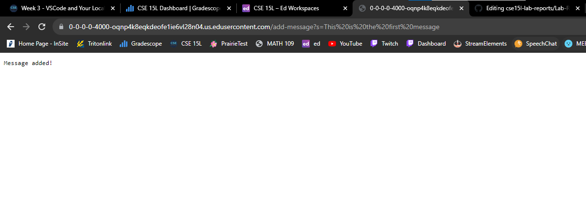
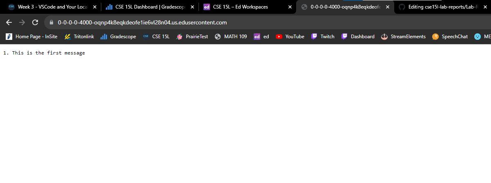
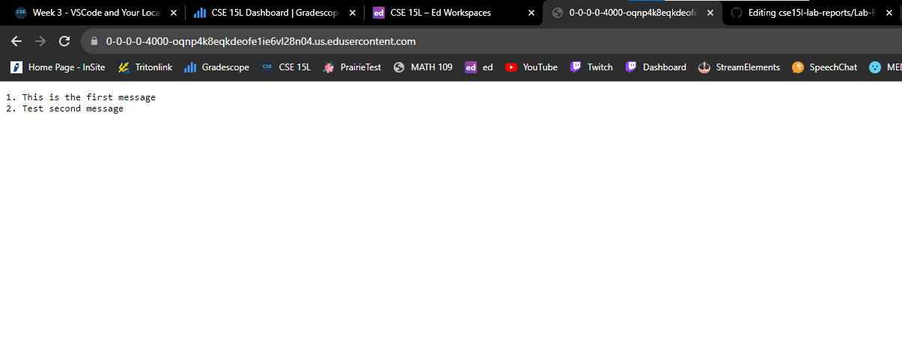

# Part 1
---
## Code:
```
import java.io.IOException;
import java.net.URI;
import java.util.ArrayList;

class Handler implements URLHandler {

    ArrayList<String> Strings = new ArrayList<String>();

    public String handleRequest(URI url) {
        if (url.getPath().equals("/")) {
            String output = "";
            for (int i = 0; i < Strings.size(); i++){
                output += String.format("%d. %s\n", i+1, Strings.get(i));
            }
            return output;
        } else {
            if (url.getPath().contains("/add-message")) {
                String[] parameters = url.getQuery().split("=");
                if (parameters[0].equals("s")) {
                    Strings.add(java.net.URLDecoder.decode(parameters[1], java.nio.charset.StandardCharsets.UTF_8));
                    return String.format("Message added!");
                }
            }
            return "404 Not Found!";
        }
    }
}

class StringServer {
    public static void main(String[] args) throws IOException {

        if(args.length == 0){
            System.out.println("Missing port number! Try any number between 1024 to 49151");
            return;
        }

        int port = Integer.parseInt(args[0]);

        Server.start(port, new Handler());
    }
}
```
---
## Screenshots:
### Message 1
<br />
**Adding Message 1 to the ArrayList using** <br />
<br />
` /add-message?s=This is the first message `
<br />
<br />

<br />
<br />
**Displaying Message 1 on the Home Page:** <br />
<br />

<br />
<br />
### Message 2
<br />
**Adding Message 2 to the ArrayList using** <br />
<br />
` /add-message?s=Test second message `
<br />
<br />

<br />
<br />
**Displaying Message 2 on the Home Page:** <br />
<br />

<br />
<br />
