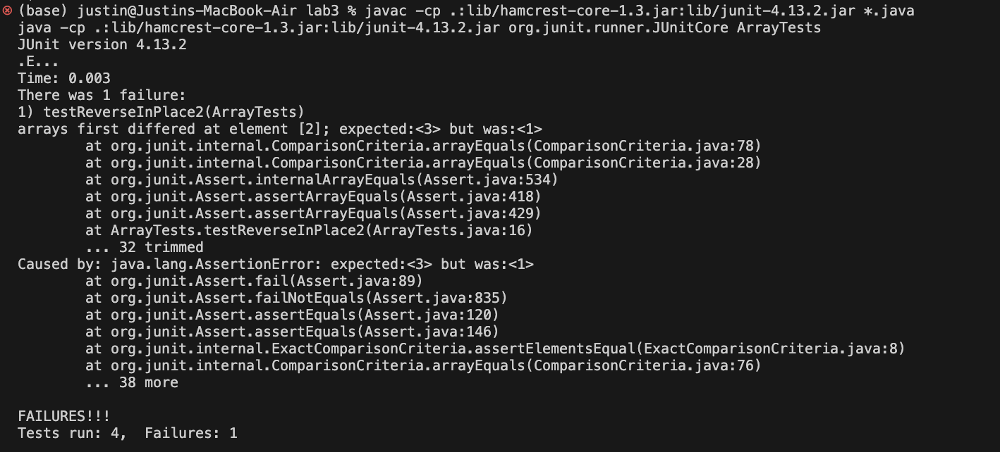

# Part 1 #
---

## ReverseInPlace Bug ##

1. A failure-inducing input for the buggy program, as a JUnit test and any associated code (write it as a code block in Markdown)
<br />

**Code for the reverseInPlace() function**

```
// Changes the input array to be in reversed order
  static void reverseInPlace(int[] arr) {
    for(int i = 0; i < arr.length; i += 1) {
      arr[i] = arr[arr.length - i - 1];
    }
  }
```
<br />

**Code for the testReverseInPlace() function (INDUCES FAILURE)**

```
@Test 
public void testReverseInPlace() {
  int[] input1 = { 3, 2, 1 };
  ArrayExamples.reverseInPlace(input1);
  assertArrayEquals(new int[]{ 1, 2, 3 }, input1);
}
```
<br />

2. An input that doesn’t induce a failure, as a JUnit test and any associated code (write it as a code block in Markdown)
<br />

**Code for the reverseInPlace() function**

```
// Changes the input array to be in reversed order
  static void reverseInPlace(int[] arr) {
    for(int i = 0; i < arr.length; i += 1) {
      arr[i] = arr[arr.length - i - 1];
    }
  }
```
<br />

**Code for the testReverseInPlace() function (PASSES)**

```
@Test 
public void testReverseInPlace() {
  int[] input1 = { 1 };
  ArrayExamples.reverseInPlace(input1);
  assertArrayEquals(new int[]{ 1 }, input1);
}
```
<br />

3. The symptom, as the output of running the tests (provide it as a screenshot of running JUnit with at least the two inputs above)


<br />

_As expected, the first case fails where the input array is {1, 2, 3}, <br />
while the second case passes where the input array is { 1 }_ <br />

4. The bug, as the before-and-after code change required to fix it (as two code blocks in Markdown) <br />

_In this case, there are two bugs. The first one is an issue with the for loop, which is looping through the entire array when it should only loop through the first half. The second bug is with the way the values are being swapped. As it is, the values are being overridden rather than swapped._
<br />
<br />
_To fix both of these, we can make two changes. The first change is in the declaration of the for loop, where we change arr.length to arr.length/2 to loop through the first half instead of all of it. The second change is adding a temporary variable to the swap, so we don't lose any values. We would change_

`arr[i] = arr[arr.length - i - 1];` 

_to_ 

```
int temp = arr[i];
arr[i] = arr[arr.length - i - 1];
arr[arr.length - i - 1] = temp;
```

<br />
<br />

_This fix addresses the issue because now when we are looping through the array, we are swapping the first half of elements with the last half of elements, while also not losing any values._

---

# Part 2 #

---

**find command**
<br />
<br />
1. find /dir -name filename.txt
   _This command searches for a file in the directory with a matching name and then returns the path._
   [GeeksForGeeks](https://www.geeksforgeeks.org/find-command-in-linux-with-examples/#)
