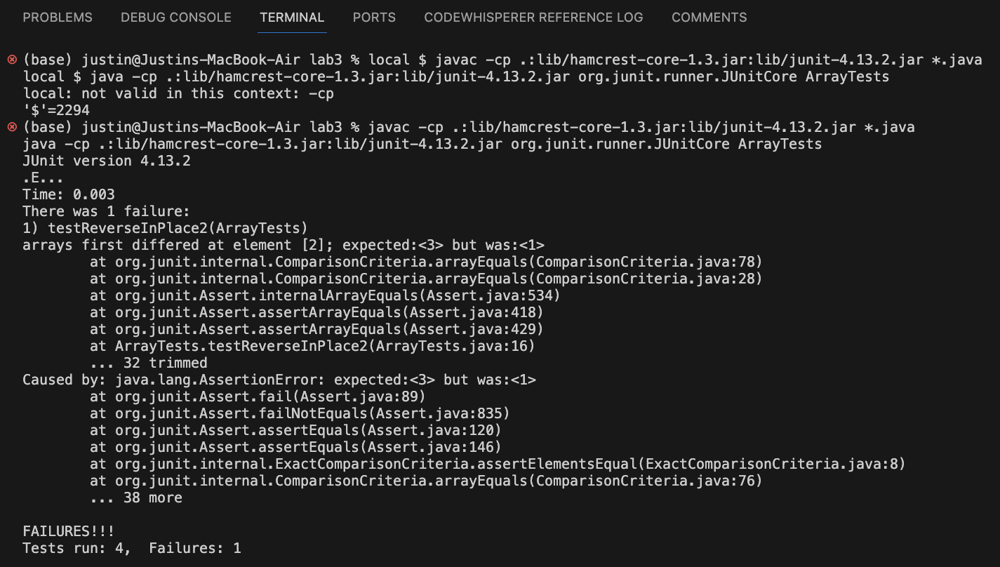

# Part 1 #
---

## ReverseInPlace Bug ##

1. A failure-inducing input for the buggy program, as a JUnit test and any associated code (write it as a code block in Markdown)
<br />

**Code for the reverseInPlace() function**

```
// Changes the input array to be in reversed order
  static void reverseInPlace(int[] arr) {
    for(int i = 0; i < arr.length; i += 1) {
      arr[i] = arr[arr.length - i - 1];
    }
  }
```
<br />

**Code for the testReverseInPlace() function (INDUCES FAILURE)**

```
@Test 
public void testReverseInPlace() {
  int[] input1 = { 3, 2, 1 };
  ArrayExamples.reverseInPlace(input1);
  assertArrayEquals(new int[]{ 1, 2, 3 }, input1);
}
```
<br />

2. An input that doesn’t induce a failure, as a JUnit test and any associated code (write it as a code block in Markdown)
<br />

**Code for the reverseInPlace() function**

```
// Changes the input array to be in reversed order
  static void reverseInPlace(int[] arr) {
    for(int i = 0; i < arr.length; i += 1) {
      arr[i] = arr[arr.length - i - 1];
    }
  }
```
<br />

**Code for the testReverseInPlace() function (PASSES)**

```
@Test 
public void testReverseInPlace() {
  int[] input1 = { 1 };
  ArrayExamples.reverseInPlace(input1);
  assertArrayEquals(new int[]{ 1 }, input1);
}
```
<br />

3. The symptom, as the output of running the tests (provide it as a screenshot of running JUnit with at least the two inputs above)


- The bug, as the before-and-after code change required to fix it (as two code blocks in Markdown) <br />
_Briefly describe why the fix addresses the issue._
