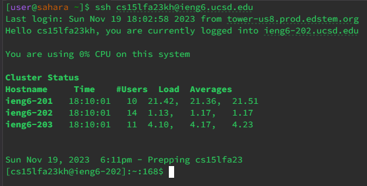
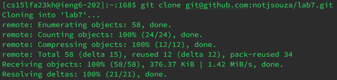
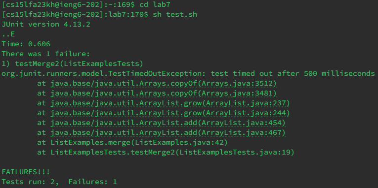
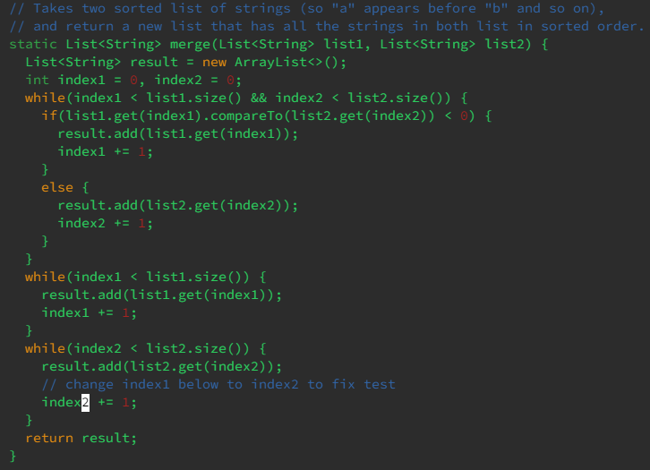
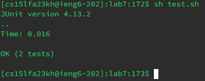
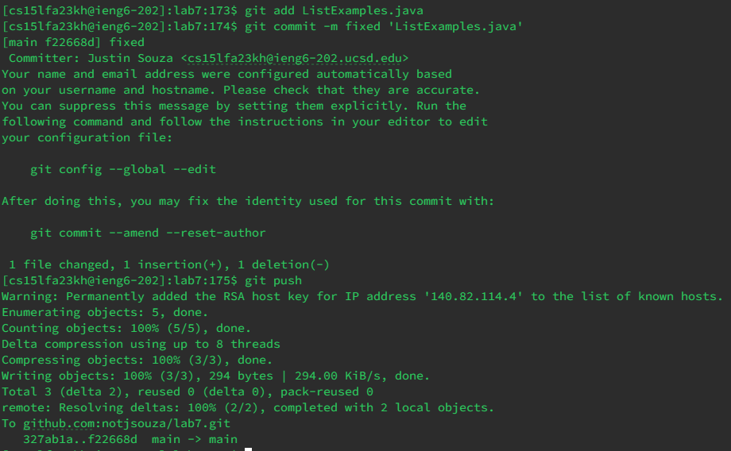

# Lab Report 4 - Vim #
---

## Step 4 ##



`<up> <up> <enter>`

## Step 5 ##
_(I have multiple monitors with the forked GitHub repository on the other screen)_ <br />



`git clone <click> <crl v> <enter>`

## Step 6 ##



```
cd lab7 <enter>
sh test.sh <enter>
```

## Step 7 ##



```
vim L <tab> .java <enter>
<right> i <backspace> 2 <esc> :wq <enter>
```

## Step 8 ##



`sh test.sh <enter>`

## Step 9 ##



```
git add L <tab> <enter>
git commit -m Fixed 'L <tab> <enter>
git push <enter>
```
