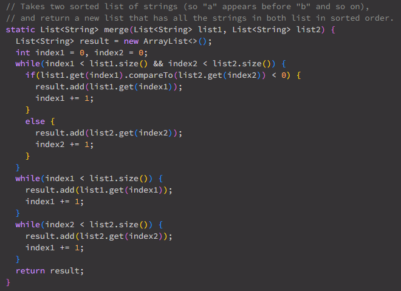
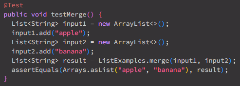
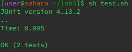

# Lab Report 5 - Putting it All Together #
---

# Part 1 #
---

## Student Post ##

 
<br />
<br />

I ran two JUnit tests through my bash script and one of them is causing a "Java heap space" error. I've narrowed down the error to the second test, which is testing the merge function, but I can't figure out what would cause this type of error in my function. Maybe it could have something to do with the way I'm adding the elements to a new ArrayList? I've added screenshots of both the function and the test code if that helps.
<br />
<br />

 
<br />
<br />

 
<br />
<br />

## TA Response ##

>An OutOfMemoryError exception occurs when there is insufficient space to add another object to a Java heap, so is there anything in your code that would be infinitely adding values? I can see that you have multiple while loops for adding values to the result list. Maybe try taking another look at the conditions/contents of those while loops to make sure they are performing as intended.

<br />

## Student Response ##



I just noticed the error in the second while loop. In the case where all the elements from list1 are merged with only some of the elements from list2, it's supposed to add the remaining values of list2 by incrementing index2 after each added value. What it was doing was incrementing index1, leading to the same element from list2 being added infinitely. Thank you for the help, all tests are passing now.

---

## For Bug Setup ##

I originally ran `git clone https://github.com/ucsd-cse15l-f23/lab3` to retrieve a fresh copy of the `lab3` repository. Inside the `lab3` directory, there are 6 items: `ArrayExamples.java`, `ArrayTests.java`, `FileExample.java`, `LinkedListExamples.java`, and `ListExamples.java`, as well as another subdirectory called `lib` that contains two files, `hamcrest-core-1.3.jar` and `junit-4.13.2.jar`. It's optional, but I deleted  `ArrayExamples.java`, `ArrayTests.java`, `FileExample.java`, and `LinkedListExamples.java`, leaving just `ListExamples.java`. So at this stage, the only items in `lab3` are `ListExamples.java` and the `lib` subdirectory. I created two new files, `ListTests.java` and `test.sh`, one of which to write tests in for `ListExamples.java`, and the other to run the tests from.
<br />
<br />
The bug originated in ListExamples.java's merge() function, where the while loop in charge of incrementing through the remainder of list2 and adding the values to the merged list was still incrementing list1's index. So, instead of incrementing index2, it was still incrementing index1 after each addition. <br />

```
static List<String> merge(List<String> list1, List<String> list2) {
    List<String> result = new ArrayList<>();
    int index1 = 0, index2 = 0;
    while(index1 < list1.size() && index2 < list2.size()) {
      if(list1.get(index1).compareTo(list2.get(index2)) < 0) {
        result.add(list1.get(index1));
        index1 += 1;
      }
      else {
        result.add(list2.get(index2));
        index2 += 1;
      }
    }
    while(index1 < list1.size()) {
      result.add(list1.get(index1));
      index1 += 1;
    }
    while(index2 < list2.size()) {
      result.add(list2.get(index2));
      index1 += 1;
    }
    return result;
  }
```

This test was being run from the terminal with `sh test.sh`, which would run `test.sh`.

```
javac -cp .:lib/hamcrest-core-1.3.jar:lib/junit-4.13.2.jar *.java ListTests.java
java -cp .:lib/hamcrest-core-1.3.jar:lib/junit-4.13.2.jar org.junit.runner.JUnitCore ListTests
```

To fix this bug, all you would need to do is change `index1` on line 43 to `index2`, then the program works as intended.

---

# Part 2 #

Learning more about git, bash, vim, and JUnit has been interesting. I've never worked with any of these before, so each one presented a unique concept that has been very fun to experiment with. I especially liked Vim, as it provides an interesting way to view and edit files on a remote server. Additionally, I appreciate the work we did with git, as while applying for internships I keep noticing that git is one of the skills that is widely sought after.
