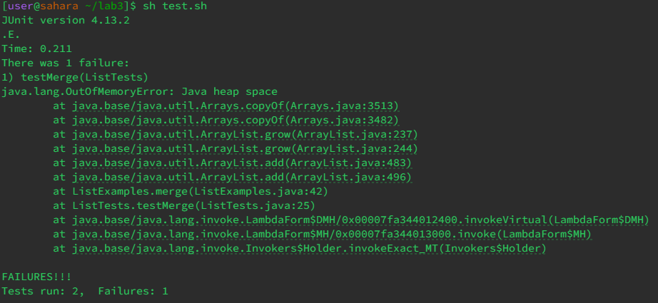
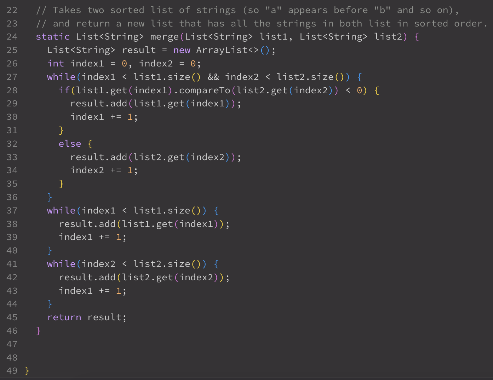
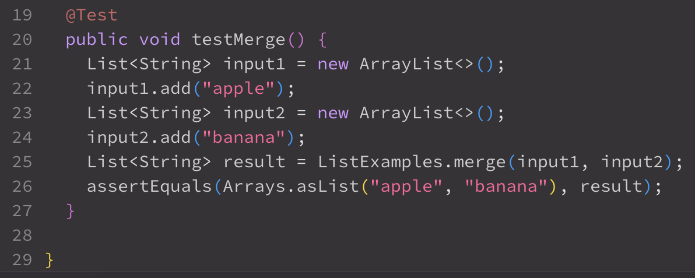

# Lab Report 5 - Putting it All Together #
---

## Part 1 ##
 
 
I ran two JUnit tests through my bash script and one of them is causing a "Java heap space" error. I've narrowed down the error to the second test, which is testing the merge function, but I can't figure out what would cause this type of error in my function. 
 
 
 
 
 
 
 

---

## Part 2 ##

